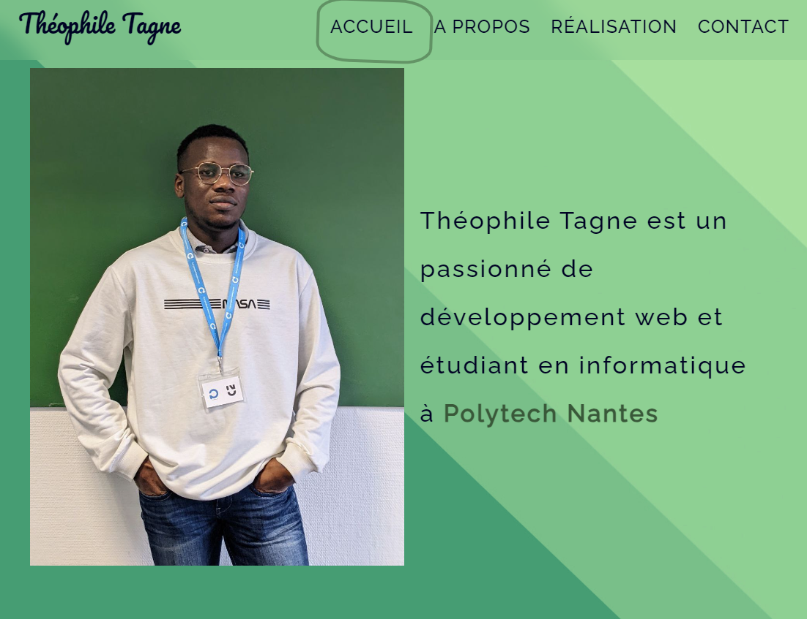

# my-portfolio-v1

## Table of Contents

- [Overview](#overview)
- [Built With](#built-with)
- [Features](#features)
- [Contact](#contact)

## Overview

<!-- TODO: UPDATE LINK FOR LIVE DEMO -->
Visit this link for a live demo <https://yoantheophile.eu.pythonanywhere.com/>

I'm a developer loving coding web applications. I am currently studying computer science at Polytech Nantes.

After designing a mockup with Figma, Angular helps me coding the frontend then PHP or python take over for the backend. In addition to this; Trello and JIRA are my best friends to manager projects.

Beyond coding, teamwork, good organization and proactivity are part of my daily life.

### Built With

This site is built using the following techno and deployed with [pythonanywhere](https://eu.pythonanywhere.com/).

- Flask
- HTML
- SCSS
- JS

## Features

Some features are presented in this site such as :

- Design
- Coding with Flask
- Information About Myself
- Contact Information

## Contact

- Live in: Nantes, France
- Email: tagnepierre9@gmail.com
